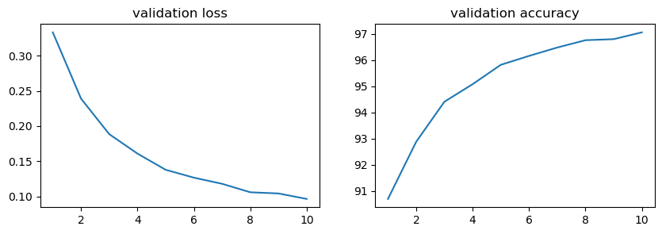
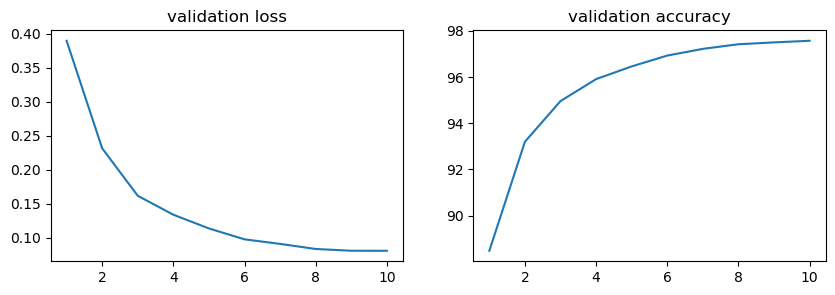
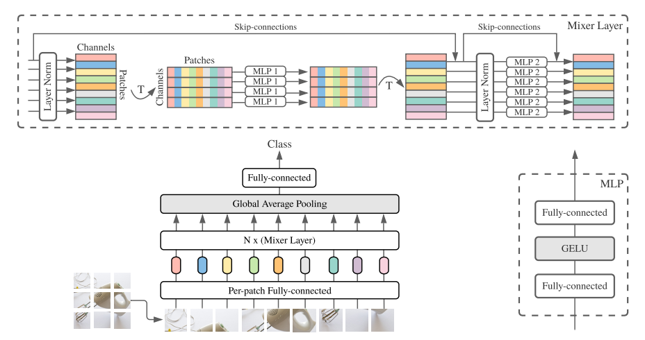

# MLP

## 复现原始版本MLP
原始版本的MLP网络结构如下：
```python
Net(
  (fc1): Linear(in_features=784, out_features=100, bias=True)
  (fc1_drop): Dropout(p=0.2, inplace=False)
  (fc2): Linear(in_features=100, out_features=80, bias=True)
  (fc2_drop): Dropout(p=0.2, inplace=False)
  (fc3): Linear(in_features=80, out_features=10, bias=True)
)
```

模型接受大小为28x28的图片输入，将其展开为784维向量放入第一个全连接层。  
模型中设置两个隐藏层，逐步将维度减小。在每个隐藏层后都设置有丢弃层，用于降低过拟合的风险。  
输出层输出维度为10，对应10个可能的类别。在最后会使用softmax函数将输出转换为概率分布。  

训练结果如下：
<center>

</center>

可以看到，经过十轮迭代，在模型准确率在97%左右。


## 调整MLP参数
### 调整优化器
将学习率调整到0.02，模型准确率稳步提高，最终达到97.5%。以下为最后几轮的训练结果：  
```python
Validation set: Average loss: 0.0899, Accuracy: 9726/10000 (97%)
Validation set: Average loss: 0.0836, Accuracy: 9751/10000 (98%)
Validation set: Average loss: 0.0785, Accuracy: 9750/10000 (98%)
Validation set: Average loss: 0.0766, Accuracy: 9755/10000 (98%)
```

将学习率调整为0.03，模型可以更快到达较高的准确率，但是在后期会出现震荡，最终准确率同样为97.5%。以下为最后几轮的训练结果：  
```python
Validation set: Average loss: 0.0844, Accuracy: 9743/10000 (97%)
Validation set: Average loss: 0.0758, Accuracy: 9768/10000 (98%)
Validation set: Average loss: 0.0762, Accuracy: 9758/10000 (98%)
Validation set: Average loss: 0.0755, Accuracy: 9764/10000 (98%)
Validation set: Average loss: 0.0778, Accuracy: 9751/10000 (98%)
```

### 调整全连接层
调整全连接层的深度与宽度，模型结构如下：
```python
MyNet(
  (fc1): Linear(in_features=784, out_features=256, bias=True)
  (fc1_drop): Dropout(p=0.2, inplace=False)
  (fc2): Linear(in_features=256, out_features=128, bias=True)
  (fc2_drop): Dropout(p=0.2, inplace=False)
  (fc3): Linear(in_features=128, out_features=64, bias=True)
  (fc3_drop): Dropout(p=0.2, inplace=False)
  (fc4): Linear(in_features=64, out_features=10, bias=True)
)
```

仅调整模型结构后的训练结果如下，最终准确率同样为97.5%。  
<center>

</center>

### 最好的模型
将调整方法进行整合。同上一样改变模型的网络结构，同时调整优化器参数`learning rate=0.02`和`momentum=0.6`。最终模型准确率达到98%。
```python
Validation set: Average loss: 0.0811, Accuracy: 9745/10000 (97%)
Validation set: Average loss: 0.0740, Accuracy: 9753/10000 (98%)
Validation set: Average loss: 0.0699, Accuracy: 9786/10000 (98%)
Validation set: Average loss: 0.0762, Accuracy: 9777/10000 (98%)
Validation set: Average loss: 0.0708, Accuracy: 9799/10000 (98%)
```

## MLP-Mixer
<!-- https://github.com/jaketae/mlp-mixer/tree/master -->
MLP-Mixer的网络结构如下：
<center>

</center>

## 总结