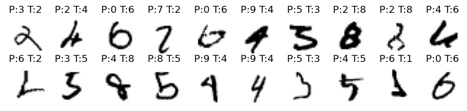
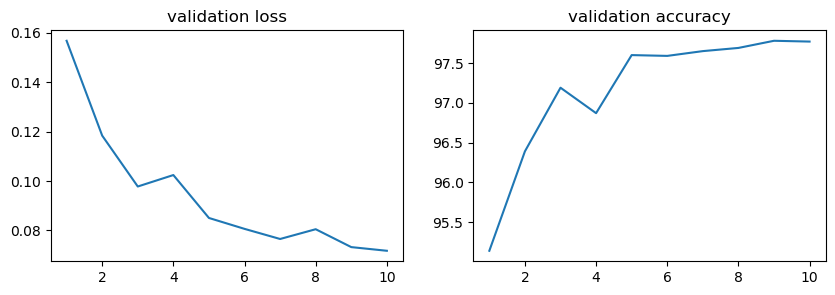

# MLP

## 复现原始版本MLP
原始版本的MLP网络结构如下：
```python
Net(
  (fc1): Linear(in_features=784, out_features=100, bias=True)
  (fc1_drop): Dropout(p=0.2, inplace=False)
  (fc2): Linear(in_features=100, out_features=80, bias=True)
  (fc2_drop): Dropout(p=0.2, inplace=False)
  (fc3): Linear(in_features=80, out_features=10, bias=True)
)
```

模型接受大小为28x28的图片输入，将其展开为784维向量放入第一个全连接层。  
模型中设置两个隐藏层，逐步将维度减小。在每个隐藏层后都设置有丢弃层，用于降低过拟合的风险。  
输出层输出维度为10，对应10个可能的类别。在最后会使用softmax函数将输出转换为概率分布。  

训练结果如下：
<center>

</center>

可以看到，经过十轮迭代，模型准确率在97%左右。


## 调整MLP参数
### 调整优化器
将学习率调整到0.02，模型**准确率稳步提高**，最终达到97.5%。以下为最后几轮的训练结果：  
```python
Validation set: Average loss: 0.0899, Accuracy: 9726/10000 (97%)
Validation set: Average loss: 0.0836, Accuracy: 9751/10000 (98%)
Validation set: Average loss: 0.0785, Accuracy: 9750/10000 (98%)
Validation set: Average loss: 0.0766, Accuracy: 9755/10000 (98%)
```

将学习率调整为0.03，模型可以**更快到达较高的准确率，但是在后期会出现震荡**，最终准确率同样为97.5%。以下为最后几轮的训练结果：  
```python
Validation set: Average loss: 0.0844, Accuracy: 9743/10000 (97%)
Validation set: Average loss: 0.0758, Accuracy: 9768/10000 (98%)
Validation set: Average loss: 0.0762, Accuracy: 9758/10000 (98%)
Validation set: Average loss: 0.0755, Accuracy: 9764/10000 (98%)
Validation set: Average loss: 0.0778, Accuracy: 9751/10000 (98%)
```

### 调整全连接层
调整全连接层的深度与宽度，模型结构如下：
```python
MyNet(
  (fc1): Linear(in_features=784, out_features=256, bias=True)
  (fc1_drop): Dropout(p=0.2, inplace=False)
  (fc2): Linear(in_features=256, out_features=128, bias=True)
  (fc2_drop): Dropout(p=0.2, inplace=False)
  (fc3): Linear(in_features=128, out_features=64, bias=True)
  (fc3_drop): Dropout(p=0.2, inplace=False)
  (fc4): Linear(in_features=64, out_features=10, bias=True)
)
```

调整模型结构后，因为宽度和深度都进行变大，模型需要**训练的参数变多，模型训练时间变长**。  
但更多的参数带来了更好的拟合能力，最终准确率为97.5%，训练完整结果如下：  
<center>

</center>

### 最好的模型
将调整方法进行整合。同上一样改变模型的网络结构，同时调整优化器参数`learning rate=0.02`和`momentum=0.6`。最终模型准确率达到98%。
```python
Validation set: Average loss: 0.0811, Accuracy: 9745/10000 (97%)
Validation set: Average loss: 0.0740, Accuracy: 9753/10000 (98%)
Validation set: Average loss: 0.0699, Accuracy: 9786/10000 (98%)
Validation set: Average loss: 0.0762, Accuracy: 9777/10000 (98%)
Validation set: Average loss: 0.0708, Accuracy: 9799/10000 (98%)
```

将模型错误分类的结果进行打印。  
可以看到，排除掉一些连人类都无法分辨的图片外，还有很多图片可以较明显地进行分类。证明模型还有提升空间，可以考虑进一步增加神经元数量等，但同时不可避免会受到MLP模型本身缺陷的制约，需要使用更多强大的模块。

<center>

</center>


## MLP-Mixer
<!-- https://github.com/jaketae/mlp-mixer/tree/master -->

MLP-Mixer的网络结构如下图所示：
<center>

</center>

1. 模型首先将图片拆分成多个patch
2. 而后使用一个全连接网络对每个patch进行处理，提取出token
3. 接着经过N个Mixer层，提取特征信息
4. 最后使用一个全连接层输出最终的分类结果

核心的Mixer结构主要由两个部分组成：Channel Mixing和Token Mixing。 
```python
class MixerBlock(nn.Module):
    '''
    dim: patch的维度(channles), num_patch: patch的数量(patches)
    token_dim: token-mix的隐藏层维度, channel_dim: channel-mix的隐藏层维度
    '''
    def __init__(self, dim, num_patch, token_dim, channel_dim, dropout = 0.):
        super().__init__()
        # token_mixing，在同一维度上各个patch/token间进行mixing
        self.token_mix = nn.Sequential(
            nn.LayerNorm(dim),  
            Rearrange('b n d -> b d n'),  # 转置
            MlpBlock(num_patch, token_dim, dropout),
            Rearrange('b d n -> b n d')  # 转置回来
        )
        # channel_mixing，在每个patch/token的各个维度上进行mixing
        self.channel_mix = nn.Sequential(
            nn.LayerNorm(dim),
            MlpBlock(dim, channel_dim, dropout),
        )

    def forward(self, x):
        # skip connection
        x = x + self.token_mix(x)
        x = x + self.channel_mix(x)
        return x
```

channel mixing作用于行，也就是在一个token内部，提取不同channel之间的信息。  
token mixing作用于列，提取不同token之间的信息。  
Mixer模块不只是MLP模块的简单堆叠，在进入MLP模块之前，会进行**LayerNorm**操作，并且在MLP模块之后，还会进行**skip connection**操作。

用于信息提取的MLP模块由两个全连接层和一个GELU激活函数组成。MLP模块保证了输入和输出的维度不变。  
```python
class MlpBlock(nn.Module):
    '''
    dim: 输入输出维度, hidden_dim: 隐藏层维度
    '''
    def __init__(self, dim, hidden_dim, dropout = 0.):
        super().__init__()
        # 两层全连接层+GELU，输入输出维度都是dim
        self.net = nn.Sequential(
            nn.Linear(dim, hidden_dim),
            nn.GELU(),
            nn.Dropout(dropout),
            nn.Linear(hidden_dim, dim),
            nn.Dropout(dropout)
        )
    def forward(self, x):
        return self.net(x)
```

设置如下的模型参数进行训练，得到的最终准确率为97.8%。
```python
mix_model = MLPMixer(in_channels=1, image_size=28, patch_size=4, num_classes=10,
                        dim=64, depth=4, token_dim=64, channel_dim=128, dropout=0.2).to(device)
my_optimizer = torch.optim.SGD(mix_model.parameters(), lr=0.03, momentum=0.6)
my_criterion = nn.CrossEntropyLoss()
```

<center>

</center>

## 实验心得
- 当隐藏层的神经元较少时，模型的表示能力较弱，容易欠拟合导致准确率较低。
- 当隐藏层的神经元较多时，模型的表示能力更强，但模型训练时间相应变长，且容易过拟合，也会导致准确率不高。
- 隐藏层的深度需要适当设置，太深会导致梯度消失，模型无法训练。
- 学习率的调整对模型的训练效果有很大的影响，合适的学习率可以使模型更快收敛。但学习率过大会导致结果震荡，过小会导致收敛速度慢。