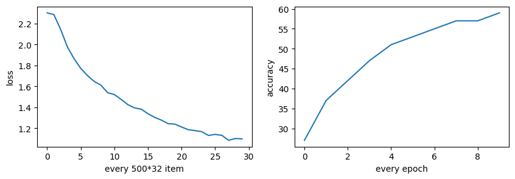
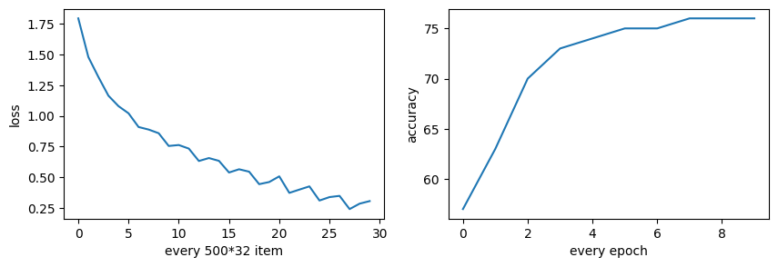
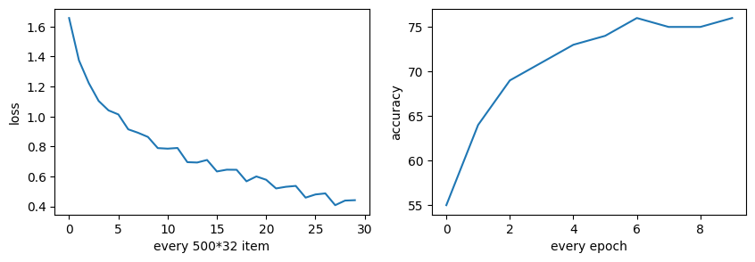
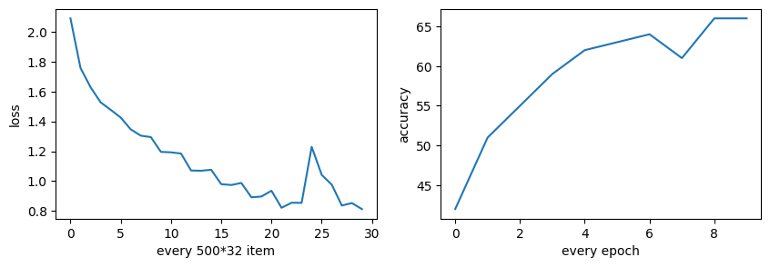

# CNN

## 原始版CNN
原始版本的卷积网络结构如下：
```python
Net(
  (conv1): Conv2d(3, 6, kernel_size=(5, 5), stride=(1, 1))
  (pool): MaxPool2d(kernel_size=2, stride=2, padding=0, dilation=1, ceil_mode=False)
  (conv2): Conv2d(6, 16, kernel_size=(5, 5), stride=(1, 1))
  (fc1): Linear(in_features=400, out_features=120, bias=True)
  (fc2): Linear(in_features=120, out_features=84, bias=True)
  (fc3): Linear(in_features=84, out_features=10, bias=True)
)
```

数据通过两个卷积层+池化层后，进入全连接层，最后输出10个类别的概率。

训练Loss曲线和准确率曲线如下：
<center>

</center>

最终准确率在60%左右。

## ResNet
复现ResNet18网络，结构如下(由于输出太长，用代码代替)：
```python
class Residual(nn.Module):
    def __init__(self, input_channels, num_channels,
                 use_1x1conv=False, strides=1):
        super().__init__()
        self.conv1 = nn.Conv2d(input_channels, num_channels,
                               kernel_size=3, padding=1, stride=strides)
        self.conv2 = nn.Conv2d(num_channels, num_channels,
                               kernel_size=3, padding=1)
        if use_1x1conv:  
            # 用于修改图片大小(stride>1)和通道数
            self.conv3 = nn.Conv2d(input_channels, num_channels,
                                   kernel_size=1, stride=strides)
        else:
            self.conv3 = None
        self.bn1 = nn.BatchNorm2d(num_channels)
        self.bn2 = nn.BatchNorm2d(num_channels)

class ResNet18(nn.Module):
    def __init__(self, in_channels, num_classes):
        super().__init__()
        # 前两层和googlenet一样
        self.conv = nn.Conv2d(in_channels, 64, kernel_size=7, stride=2, padding=3)
        self.bn = nn.BatchNorm2d(64)
        self.relu = nn.ReLU()
        self.mp = nn.MaxPool2d(kernel_size=3, stride=2, padding=1)

        # ResNet的主体结构：4个模块，每个模块包含两个残差块
        # 第一个模块块不改变通道数和大小
        # 后面的每个模块将上一个模块的通道数翻倍，大小减半
        self.resnet_block1 = nn.Sequential(*resnet_block(64, 64, 2, first_block=True))
        self.resnet_block2 = nn.Sequential(*resnet_block(64, 128, 2))
        self.resnet_block3 = nn.Sequential(*resnet_block(128, 256, 2))
        self.resnet_block4 = nn.Sequential(*resnet_block(256, 512, 2))
        
        # 全局平均池化层与全连接层
        self.global_avg_pool = nn.AdaptiveAvgPool2d((1, 1))
        self.fc = nn.Linear(512, num_classes)
```

- 网络前两层和GoogleNet类似，使用7x7的卷积核，后接BatchNorm和ReLU激活函数，最好是MaxPool2d池化层。
- 之后是4个ResNet Block，每个Block包含两个Residual Block，每个Residual Block包含两个卷积层和BatchNorm。
- 最后是全局平均池化层和全连接层。

训练Loss曲线和准确率曲线如下：
<center>

</center>

最终准确率在75%左右，相较于基础CNN提升巨大。

## DenseNet
DenseNet的结构如下：
```python
def transition_block(input_channels, num_channels):
    # 过渡层用来控制模型的复杂度
    # 通过1x1卷积层来减小通道数，使用步幅为2的平均池化层减半高和宽
    return nn.Sequential(
        nn.BatchNorm2d(input_channels), nn.ReLU(),
        nn.Conv2d(input_channels, num_channels, kernel_size=1),
        nn.AvgPool2d(kernel_size=2, stride=2))

class DenseNet(nn.Module):
    def __init__(self, in_channels, num_channels, growth_rate, num_classes):
        super(DenseNet, self).__init__()
        # DenseNet首先使用同ResNet一样的单卷积层和最大池化层
        self.b1 = nn.Sequential(
            nn.Conv2d(in_channels, num_channels, kernel_size=7, stride=2,
                      padding=3),
            nn.BatchNorm2d(num_channels), nn.ReLU(),
            nn.MaxPool2d(kernel_size=3, stride=2, padding=1))
        
        # DenseNet使用4个稠密块，每个使用4个卷积层，与ResNet的主体结构类似
        num_convs_in_dense_blocks = [4, 4, 4, 4]
        blks = []
        # 每个稠密块通道数增加growth_rate*4
        for i, num_convs in enumerate(num_convs_in_dense_blocks):
            blks.append(DenseBlock(num_convs, num_channels, growth_rate))
            # 上一个稠密块的输出通道数
            num_channels += num_convs * growth_rate
            # 在稠密块之间加入一个过渡层
            if i != len(num_convs_in_dense_blocks) - 1:
                blks.append(transition_block(num_channels, num_channels // 2))
                num_channels = num_channels // 2
        
        # DenseNet最后接上全局池化层和全连接层来输出
        self.b2 = nn.Sequential(*blks, nn.BatchNorm2d(num_channels), nn.ReLU(),
                                 nn.AdaptiveMaxPool2d((1, 1)),
                                 nn.Flatten(), nn.Linear(num_channels, num_classes))
```

- DenseNet首先使用同ResNet一样的单卷积层和最大池化层。
- 之后使用4个稠密块，每个稠密块包含4个卷积层，每个卷积层的输出通道数为`num_channels + i * growth_rate`。
- 每个稠密块之间加入一个过渡层，过渡层通过1x1卷积层来减小通道数，使用步幅为2的平均池化层减半高和宽。
- 最后接上全局池化层和全连接层来输出。

训练Loss曲线和准确率曲线如下：
<center>

</center>

最终准确率在76%左右，因为并没有使用DenseNet 121等更深的网络，而只是使用了一个简单的DenseNet，所以相较于ResNet提升不大。

## MobileNet
MobileNet的结构如下：
```python
def conv_dw(in_channels, num_channels, stride):
    return nn.Sequential(
        # depthwise，对每个输入通道分别进行卷积
        nn.Conv2d(in_channels, in_channels, 3, stride, 1, groups=in_channels, bias=False),
        nn.BatchNorm2d(in_channels),
        nn.ReLU(inplace=True),

        # pointwise，实现通道之间的信息交互
        nn.Conv2d(in_channels, num_channels, 1, 1, 0, bias=False),
        nn.BatchNorm2d(num_channels),
        nn.ReLU(inplace=True),
        )

class MobileNetV1(nn.Module):
    def __init__(self, in_channels, num_classes):
        super(MobileNetV1, self).__init__()
        self.model = nn.Sequential(
            conv_bn(in_channels, 32, 2),
            conv_dw(32, 64, 1),
            conv_dw(64, 128, 2),
            conv_dw(128, 128, 1),
            conv_dw(128, 256, 2),
            conv_dw(256, 256, 1),
            conv_dw(256, 512, 2),
            conv_dw(512, 512, 1),
            conv_dw(512, 512, 1),
            conv_dw(512, 512, 1),
            conv_dw(512, 512, 1),
            conv_dw(512, 512, 1),
            conv_dw(512, 1024, 2),
            conv_dw(1024, 1024, 1),
            nn.AdaptiveAvgPool2d(1)
        )
        self.fc = nn.Linear(1024, num_classes)
```

- MobileNetV1使用了深度可分离卷积，即先对每个输入通道分别进行卷积，再对通道之间的信息进行交互。
- MobileNetV1首先使用一个普通的卷积层，之后使用13个深度可分离卷积层，最后接上全局平均池化层和全连接层。

训练Loss曲线和准确率曲线如下：
<center>

</center>

由于网络参数较少，训练速度较快，最终准确率在65%左右。

