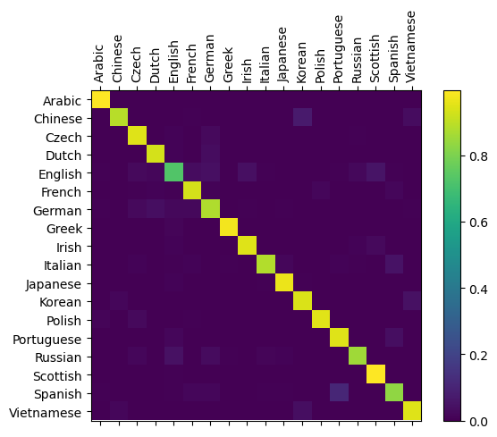

# RNN

## 原始版本RNN
原始版本RNN网络结构如下：
```python
RNN(
  (i2h): Linear(in_features=185, out_features=128, bias=True)
  (i2o): Linear(in_features=185, out_features=18, bias=True)
  (softmax): LogSoftmax(dim=1)
)
```
其中`i2h`是输入到隐藏状态的线性变换，`i2o`是输入到输出的线性变换，`softmax`是输出层的激活函数。  
给定input和hidden后，将input和hidden拼接起来，通过`i2h`得到新的hidden，通过`i2o`得到output。

RNN的训练过程如下：
```python
def train(category_tensor, line_tensor, net):
    h0 = net.initHidden()
    net.zero_grad()
    # 一次输入一个字符
    for i in range(line_tensor.size()[0]):
        output, h0 = net(line_tensor[i], h0)

    loss = criterion(output, category_tensor)
    loss.backward()  # 计算梯度

    # 没有使用optimizer，手动更新参数
    for p in net.parameters():
        p.data.add_(p.grad.data, alpha=-learning_rate)

    return output, loss.item()
```

对于序列数据，RNN每次接收序列中的一个元素，得到对应的输出和隐藏状态。  
将得到的隐藏状态和下一元素一并传入得到下一次的输出与隐藏状态，如此重复。  
将最后一个输出与目标值计算损失，反向传播更新参数。

模型运行结果曲线如下：
<center>

</center>

loss稳定在1.2左右，accuracy稳定在60%左右。模型效果一般，有较大提升空间。

模型预测矩阵如下所示：
<center>

</center>

矩阵对角线较为清晰，整体准确率在0.6左右。  
对Greek预测最为准确，对English预测最差，对角线上English几乎成黑色。

## LSTM
使用PyTorch提供的LSTM库实现的LSTM网络结构如下：
```python
LSTM(
  (rnn): LSTM(57, 128)
  (out): Linear(in_features=128, out_features=18, bias=True)
  (softmax): LogSoftmax(dim=-1)
)
```

与原始版本RNN不同，使用PyTorch的LSTM库后，可以一次性输入整个序列数据。  
网络返回每一个元素的output结果，计算损失时只取最后一个output。  
```python
def train(category_tensor, line_tensor, net):
    h0, c0 = net.initHidden()
    net.zero_grad()
    # 直接输入整个句子就可以，pytorch会自动处理
    output, h, c = net(line_tensor, h0, c0)

    loss = criterion(output[-1], category_tensor)  # 取最后一个输出
    loss.backward()  # 计算梯度

    # 没有使用optimizer，手动更新参数
    for p in net.parameters():
        p.data.add_(p.grad.data, alpha=-learning_rate)

    return output, loss.item()
```

模型运行结果曲线如下：
<center>

</center>

因为LSTM使用了门控单元，可以更好地处理长序列数据，因此可以使用更大的学习率。  
可以看到，loss稳定在0.3左右，accuracy最终约为85%。模型性能提升明显。

模型预测矩阵如下所示：
<center>

</center>

矩阵对角线明显更为明亮。与RNN结果相同的是，English的预测结果最差。


## LSTM优于RNN的原因
### RNN梯度消失和梯度爆炸
RNN在处理的Sequence长度很长时会产生梯度爆炸或消失，所以RNN实际上只能学习到短期依赖关系。  
损失函数对$W$的偏导为:
$$
\frac{\partial L}{\partial W}=\sum_{t=1}^{\tau} \frac{\partial L^{(t)}}{\partial W}=\sum_{t=1}^{\tau} \sum_{k=1}^{t} \frac{\partial L^{(t)}}{\partial \widehat{\boldsymbol{y}}^{(t)}} \frac{\partial \widehat{\boldsymbol{y}}^{(t)}}{\partial \boldsymbol{o}^{(t)}} \frac{\partial \boldsymbol{o}^{(t)}}{\partial \boldsymbol{h}^{(t)}} \frac{\partial \boldsymbol{h}^{(t)}}{\partial \boldsymbol{h}^{(k)}} \frac{\partial \boldsymbol{h}^{(k)}}{\partial W}
$$
因为：
$
\frac{\partial \boldsymbol{h}^{(t)}}{\partial \boldsymbol{h}^{(k)}}=\prod_{i=k+1}^{t} \frac{\partial \boldsymbol{h}^{(i)}}{\partial \boldsymbol{h}^{(i-1)}}
$


根据推导可知序列损失函数对$U$和$W$的偏导为：
$$
\begin{array}{l}
\frac{\partial L}{\partial W}=\sum_{t} \sum_{k=1}^{k=t} \frac{\partial L^{(t)}}{\partial \hat{\boldsymbol{y}}^{(t)}} \frac{\partial \hat{\boldsymbol{y}}^{(t)}}{\partial \boldsymbol{o}^{(t)}} \frac{\partial \boldsymbol{o}^{(t)}}{\partial \boldsymbol{h}^{(t)}}\left(\prod_{i=k+1}^{t} W^{\top} \operatorname{diag}\left(1-\left(\boldsymbol{h}^{(i)}\right)^{2}\right)\right) \frac{\partial \boldsymbol{h}^{(k)}}{\partial W} \\

\frac{\partial L}{\partial U}=\sum_{t} \sum_{k=1}^{k=t} \frac{\partial L^{(t)}}{\partial \hat{\boldsymbol{y}}^{(t)}} \frac{\partial \hat{\boldsymbol{y}}^{(t)}}{\partial \boldsymbol{o}^{(t)}} \frac{\partial \boldsymbol{o}^{(t)}}{\partial \boldsymbol{h}^{(t)}}\left(\prod_{i=k+1}^{t} W^{\top} \operatorname{diag}\left(1-\left(\boldsymbol{h}^{(i)}\right)^{2}\right)\right) \frac{\partial \boldsymbol{h}^{(k)}}{\partial U}
\end{array}
$$
令 $\gamma=\left\|\prod_{i=k+1}^{t} W^{\top} \operatorname{diag}\left(1-\left(\boldsymbol{h}^{(i)}\right)^{2}\right)\right\|_{2}$

当Sequence长度很长时，$t>>k$，就会产生爆炸或消失。
$$
r\left\{\begin{array}{l}
\rightarrow \infty, \frac{\partial L}{\partial U} \rightarrow \infty,\frac{\partial L}{\partial W} \rightarrow \infty \\

\rightarrow 0, \frac{\partial L}{\partial W} \rightarrow 0,\frac{\partial L}{\partial U} \rightarrow 0
\end{array}\right.
$$

### LSTM门控单元
LSTM通过“门”（gate）来控制丢弃或者增加信息，从而实现遗忘或记忆的功能，使得LSTM可以学习到长期依赖关系。

* 遗忘门 $f_t$ 控制上一个时刻的内部状态 $c_{t-1}$ 需要遗忘多少信息：

  $$f_{t}=\sigma\left(W_{f} \cdot\left[h_{t-1}, x_{t}\right]+b_{f}\right)$$

  本质上是以上一单元的输出 $ℎ_{t-1}$ 和本单元的输入 $x_t$为输入的sigmoid函数，为 $c_{t-1}$中的每一项产生一个在[0,1]内的值，来控制上一单元状态被遗忘的程度。

* 输入门$i_t$ 控制当前时刻的候选状态 $\tilde{c}_{t}$需要保存多少信息：

  $$
  \begin{aligned}
  i_{t} & =\sigma\left(W_{i} \cdot\left[h_{t-1}, x_{t}\right]+b_{i}\right) \\

  \tilde{C}_{t} & =\tanh \left(W_{C} \cdot\left[h_{t-1}, x_{t}\right]+b_{c}\right)
  \end{aligned}
  $$
  输入门和一个tanh函数配合控制加入的新信息。

* 输出门$o_t$ 控制当前时刻的内部状态$c_{t}$有多少信息需要输出给外部状态 $h_t$：

  $$
  \begin{aligned}
  o_{t} & =\sigma\left(W_{o} \cdot\left[h_{t-1}, x_{t}\right]+b_{o}\right) \\

  h _ { t } & = O _ { t } * \tan h ( C _ { t } )
  \end{aligned}
  $$
  输出门用来控制当前的单元状态有多少被过滤掉，使用sigmoid产生一个在[0,1]内的值，控制单元状态被过滤的程度。

LSTM网络中，记忆单元c可以在某个时刻捕捉到某个关键信息，并有能力将此关键信息保存一定的时间间隔。其保存信息的生命周期要长于短期记忆h，所以LSTM可以更好的学习到长期依赖。


## 自己实现LSTM
自己实现的LSTM网络结构图如下：
```python
LSTMModel(
  (lstm1): LSTMBlock()
  (linear): Sequential(
    (0): Linear(in_features=128, out_features=10, bias=True)
    (1): LogSoftmax(dim=1)
  )
)
```
其中LSTMBlock是按照公式构造的LSTM单元：
```python
def forward(self, x, h_t, c_t):
    i_t = torch.sigmoid(x @ self.W_xi + h_t @ self.W_hi + self.b_i)
    f_t = torch.sigmoid(x @ self.W_xf + h_t @ self.W_hf + self.b_f)
    g_t = torch.tanh(x @ self.W_xc + h_t @ self.W_hc + self.b_c)
    o_t = torch.sigmoid(x @ self.W_xo + h_t @ self.W_ho + self.b_o)
    c_t = f_t * c_t + i_t * g_t
    h_t = o_t * torch.tanh(c_t)
    return h_t, c_t
```

训练上，和前述的RNN网络类似，每次接收序列中的一个元素，得到对应的输出和隐藏状态，循环重复得到最后一次输出计算损失。

模型运行结果曲线如下：
<center>

</center>

可以看到，loss稳定在0.3左右，accuracy稳定在90%。  
整体性能略优于使用PyTorch提供的LSTM库实现的LSTM。但模型的训练时间远长于后者。 


模型预测矩阵如下所示：
<center>

</center>

矩阵对角线几乎全呈亮黄色，证明模型性能优秀。English颜色为绿色，效果最差。