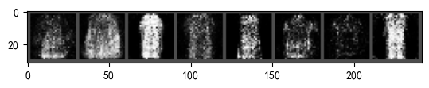
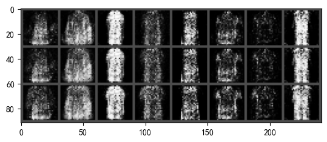
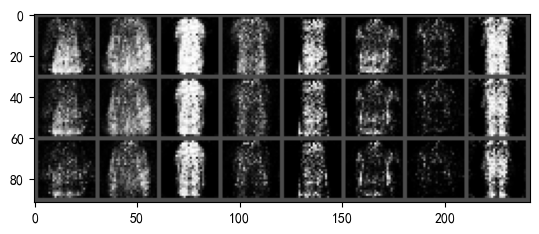
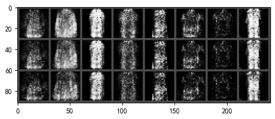
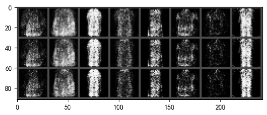
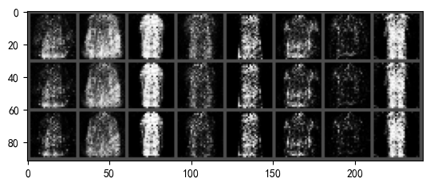
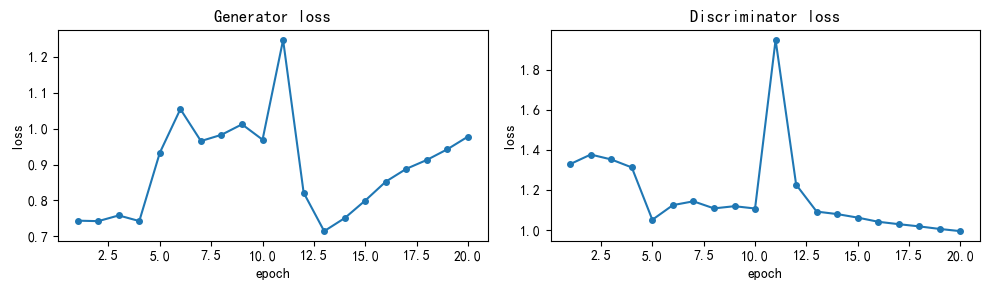
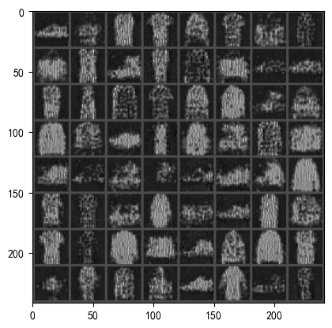

# GAN

## GAN基本原理
GAN(Generative Adversarial Networks)是一种生成模型，由两个网络组成，一个生成网络G和一个判别网络D。
- Generator: 生成网络，输入一个随机噪声，通过网络生成样本。
- Discriminator: 判别网络，输入一个样本，输出样本是真实样本的概率。

生成网络的训练目标是尽量生成真实样本，使得判别网络无法区分生成的样本和真实样本。

判别网络的训练目标是尽量区分生成的样本和真实样本。损失值由两部分组成，一部分是真实样本的损失，另一部分是生成样本的损失。

## 原始版本GAN
### 网络结构
原始版本的GAN网络结构比较简单，生成网络和判别网络都是全连接网络。
```python
Discriminator(
  (fc1): Linear(in_features=784, out_features=128, bias=True)
  (nonlin1): LeakyReLU(negative_slope=0.2)
  (fc2): Linear(in_features=128, out_features=1, bias=True)
)
Generator(
  (fc1): Linear(in_features=100, out_features=128, bias=True)
  (nonlin1): LeakyReLU(negative_slope=0.2)
  (fc2): Linear(in_features=128, out_features=784, bias=True)
)
```

- Generator: 输入是一个100维的随机噪声，通过第一个全连接层生成128维的特征，激活函数使用LeakyReLU，通过第二个全连接层生成784维的输出，最后reshape成28x28的图片。
- Discriminator: 输入是一个(1, 28, 28)的图片，reshape成784维的向量，通过第一个全连接层生成128维的特征，激活函数使用LeakyReLU，通过第二个全连接层生成1维的输出，再通过sigmoid激活函数输出概率。

### 训练LOSS
Discriminator和Generator均使用二分类交叉熵损失函数，训练LOSS曲线如下：
<center>

</center>

- Discriminator的损失值由真实样本的损失和生成样本的损失组成。可以看到，判别器的loss不断提高，说明生成器生成的样本越来越接近真实样本。
- Generator的损失值由生成样本的损失组成，比较生成的图片和真实图片的相似度。生成器的loss不太稳定，但是整体趋势是下降的。

## 生成图片
### 自定义一组随机数，生成8张图
设置随机种子，而后向模型输入8个长度为100的随机数，生成8张图片。
```pyhton
torch.manual_seed(12138)
z = torch.randn(8, 100, device=device) # random noise, 64 samples, z_dim=100
x_gen = G(z).detach()
show_imgs(x_gen)
```

生成结果如下：
<center>

</center>

### 调整随机数
随机选取了五个位置[18,28,54,73,80]，每个位置都会从[-2,1,4]进行调整，结果如下。
- postion 18: 
  <center>
  
  </center>
- postion 28: 
  <center>
  
  </center>
- postion 54:
  <center>
  
  </center>
- postion 73:
  <center>
  
  </center>
- postion 80:
  <center>
  
  </center>


1. 在同一个位置改变初始值的大小，主要影响的是图像的亮度。因为同一位置的权重相同，改变值的大小只会影响最终的灰度值，进而改变图像的亮度。
2. 在不同位置改变值时，主要影响的是图像的形状和纹理。因为不同位置的权重不同，改变后生成的特征向量发生变化，反应在结果上就是生成的衣服样式发生改变。


生成器学习的是如何将这个分布的噪声映射到逼真的数据空间。如果输入的噪声分布发生了变化，生成器将无法正确地将这种新的分布映射到数据空间，导致生成的图像出现混乱和失真。  
输入的噪声的关键是要保证噪声的分布合理，如果经过调整以后数据的总体分布与原来的数据分布保持一致，才会得到合理的输出。


## 卷积版本GAN
### 网络结构
使用卷积实现GAN，生成网络和判别网络都是卷积网络。网络结构如下：
```python
DiscriminatorCNN(
  (conv): Sequential(
    (0): Conv2d(1, 1, kernel_size=(2, 2), stride=(2, 2))
    (1): LeakyReLU(negative_slope=0.2)
  )
  (fc): Sequential(
    (0): Linear(in_features=196, out_features=128, bias=True)
    (1): LeakyReLU(negative_slope=0.2)
    (2): Linear(in_features=128, out_features=1, bias=True)
    (3): LeakyReLU(negative_slope=0.2)
  )
)
GeneratorCNN1(
  (fc): Sequential(
    (0): Linear(in_features=100, out_features=900, bias=True)
    (1): LeakyReLU(negative_slope=0.2)
  )
  (conv): Sequential(
    (0): Conv2d(1, 64, kernel_size=(2, 2), stride=(1, 1))
    (1): LeakyReLU(negative_slope=0.2)
    (2): Conv2d(64, 1, kernel_size=(2, 2), stride=(1, 1))
    (3): LeakyReLU(negative_slope=0.2)
  )
)
```

- 判别器首先使用一个卷积层得到特征图，再通过全连接层得到输出。
- 生成器首先通过全连接层得到特征向量，再通过卷积层得到输出。

### 实验结果
训练LOSS曲线如下：
<center>

</center>

生成结果如下，图像亮度相较于原始版本GAN较暗。
<center>

</center>


