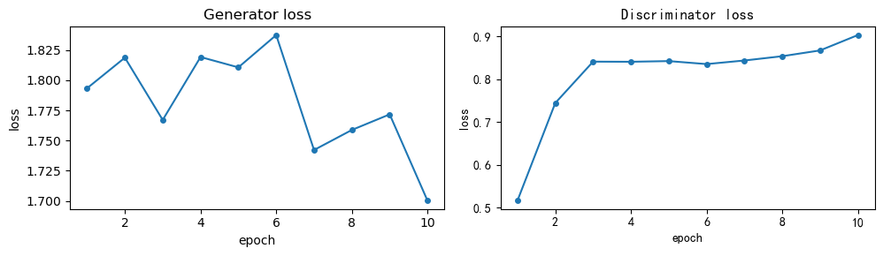

# GAN

## GAN基本原理
GAN(Generative Adversarial Networks)是一种生成模型，由两个网络组成，一个生成网络G和一个判别网络D。
- Generator: 生成网络，输入一个随机噪声，通过网络生成样本。
- Discriminator: 判别网络，输入一个样本，输出样本是真实样本的概率。

生成网络的训练目标是尽量生成真实样本，使得判别网络无法区分生成的样本和真实样本。

判别网络的训练目标是尽量区分生成的样本和真实样本。损失值由两部分组成，一部分是真实样本的损失，另一部分是生成样本的损失。

## 原始版本GAN
### 网络结构
原始版本的GAN网络结构比较简单，生成网络和判别网络都是全连接网络。
```python
Discriminator(
  (fc1): Linear(in_features=784, out_features=128, bias=True)
  (nonlin1): LeakyReLU(negative_slope=0.2)
  (fc2): Linear(in_features=128, out_features=1, bias=True)
)
Generator(
  (fc1): Linear(in_features=100, out_features=128, bias=True)
  (nonlin1): LeakyReLU(negative_slope=0.2)
  (fc2): Linear(in_features=128, out_features=784, bias=True)
)
```

- Generator: 输入是一个100维的随机噪声，通过第一个全连接层生成128维的特征，激活函数使用LeakyReLU，通过第二个全连接层生成784维的输出，最后reshape成28x28的图片。
- Discriminator: 输入是一个(1, 28, 28)的图片，reshape成784维的向量，通过第一个全连接层生成128维的特征，激活函数使用LeakyReLU，通过第二个全连接层生成1维的输出，再通过sigmoid激活函数输出概率。

### 训练LOSS
Discriminator和Generator均使用二分类交叉熵损失函数，训练LOSS曲线如下：
<center>

</center>

- Discriminator的损失值由真实样本的损失和生成样本的损失组成。可以看到，判别器的loss不断提高，说明生成器生成的样本越来越接近真实样本。
- Generator的损失值由生成样本的损失组成，比较生成的图片和真实图片的相似度。生成器的loss不太稳定，但是整体趋势是下降的。

## 改变随机数

## 卷积版本GAN
### 网络结构

### 训练LOSS
